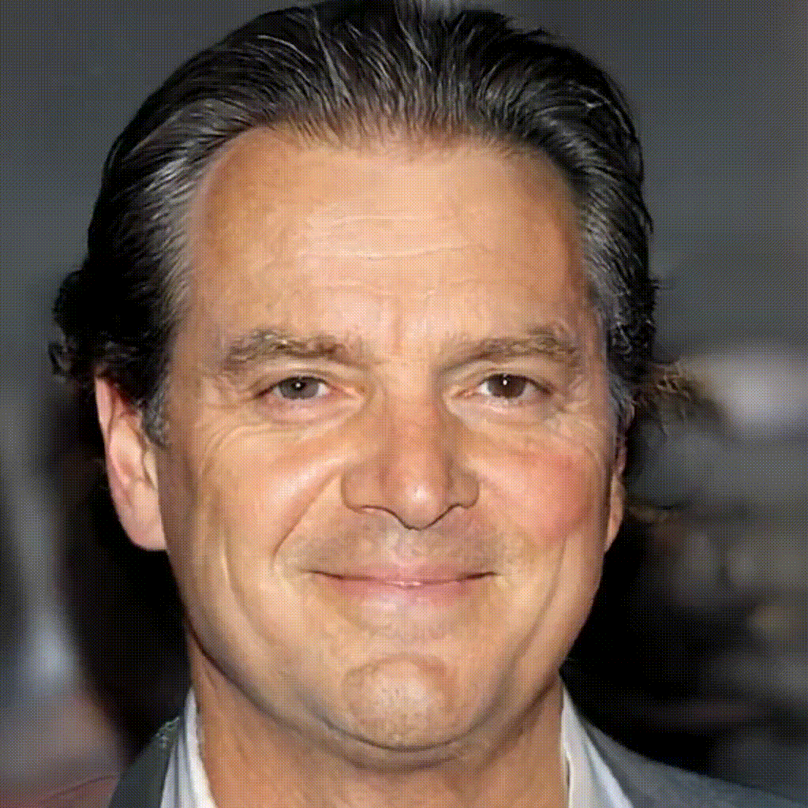
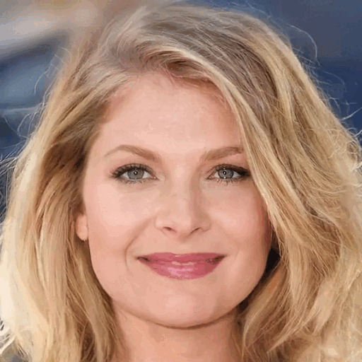
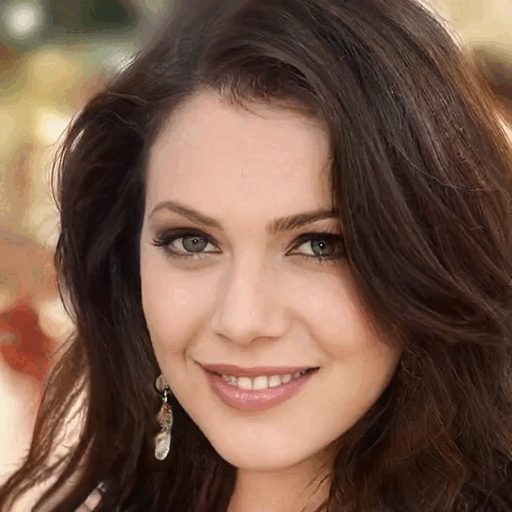

# Linearly Controllable GAN: Unsupervised Feature Categorization and Decomposition for Image Generation and Manipulation

# Requirements

# Demo videos
We explore the controllability of our image generation model by systematically varying the value of a single dimension across a predefined range. Specifically, we adjust this dimension from -2 to 2, allowing for a comprehensive examination of how changes in this parameter influence the characteristics of the generated images. This approach enables us to assess the model's controllability and understand how different input dimensions contribute to the overall image generation process.
## Training on Celeba-HQ 1024x1024

    
    
    
     
    
    
    
     
    
    
    

## Training on AFHQ-V2 512x512
