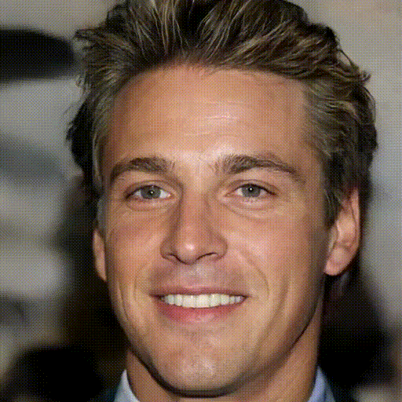
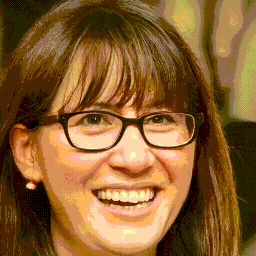
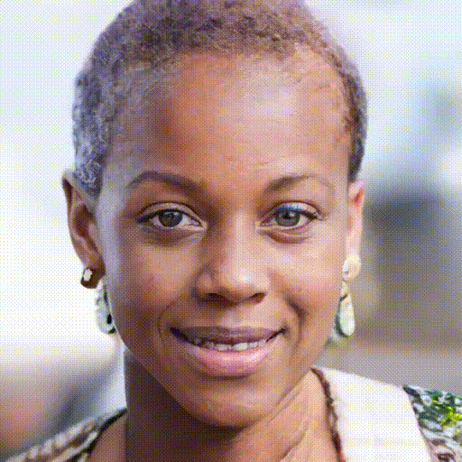
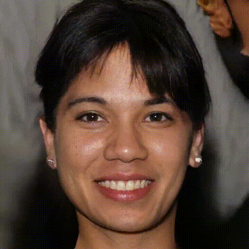
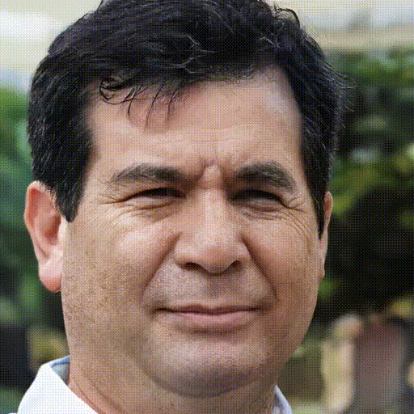
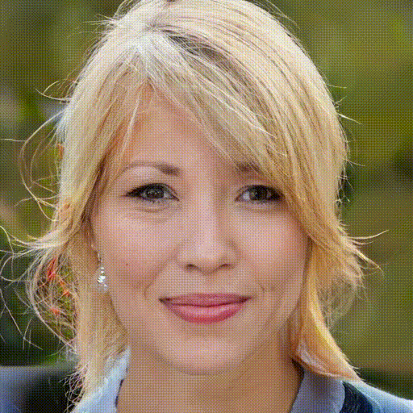
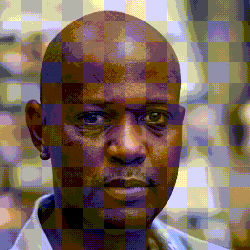

# Linearly Controllable GAN: Unsupervised Feature Categorization and Decomposition for Image Generation and Manipulation 
This is the official repository of LC-GAN (ECCV2024) by [Rakuten Institute of Technology, Rakuten Group, Inc.](https://rit.rakuten.com/)
- [Paper](https://www.ecva.net/papers/eccv_2024/papers_ECCV/papers/00540.pdf)

If you find our code or paper useful, please cite as

    @inproceedings{lee2024linearly,
        title={Linearly Controllable GAN: Unsupervised Feature Categorization and Decomposition for Image Generation and Manipulation},
        author={Lee, Sehyung and Kim, Mijung and Chae, Yeongnam and Stenger, Bj{\"o}rn},
        booktitle={European Conference on Computer Vision},
        year={2024},
    }

# Requirements and installations
We used the 4x or 8x NVIDIA(R) Hopper H100-HBM3-80GB to train the model with the following libraries.

    pip install torch==2.2.1 torchvision==0.17.1 torchaudio==2.2.1 --index-url https://download.pytorch.org/whl/cu121
    pip install -U albumentations av

# Datasets
We trained the model on the three different datasets with different resolutions (256x256, 512x512, and 1024x1024):
- [Celeba-HQ](https://github.com/tkarras/progressive_growing_of_gans)
- [FFHQ](https://github.com/NVlabs/ffhq-dataset)
- [AFHQ-V2](https://github.com/clovaai/stargan-v2)

# Training
Training on FFHQ at 1024x1024 resolution using 8 H100 GPUs

    python main.py --phase train --model_name ffhq_1024 --dataset_path DATASET_PATH --epoch 900000 --batch_size 32 --freezeD_start 500000 --freezeD_layer 5 --img_resolution 1024 --g_lr 0.001 --d_lr 0.001 --tau 0.05 --l_adv 1.0 --l_aux 0.5 --l_r1 10.0 --l_s 1e-07

Training on Celeba-HQ 1024x1024 resolution using 8 H100 GPUs

    python main.py --phase train --model_name celeba_hq_1024 --dataset_path DATASET_PATH --epoch 700000 --batch_size 32 --freezeD_start 300000 --freezeD_layer 5 --img_resolution 1024 --g_lr 0.001 --d_lr 0.001 --tau 0.05 --l_adv 1.0 --l_aux 0.5 --l_r1 10.0 --l_s 1e-07

Training on FFHQ 512x512 resolution using 4 H100 GPUs

    python main.py --phase train --model_name ffhq_512 --dataset_path DATASET_PATH --epoch 900000 --batch_size 32 --freezeD_start 500000 --freezeD_layer 4 --img_resolution 512 --g_lr 0.002 --d_lr 0.002 --tau 0.05 --l_adv 1.0 --l_aux 0.5 --l_r1 10.0 --l_s 1e-07

Training on Celeba-HQ 512x512 resolution using 4 H100 GPUs

    python main.py --phase train --model_name celeba_hq_512 --dataset_path DATASET_PATH --epoch 700000 --batch_size 32 --freezeD_start 300000 --freezeD_layer 4 --img_resolution 512 --g_lr 0.002 --d_lr 0.002 --tau 0.05 --l_adv 1.0 --l_aux 0.5 --l_r1 10.0 --l_s 1e-07

Training on AFHQ-V2 512x512 resolution using 4 H100 GPUs

    python main.py --phase train --model_name afhq_v2_512 --dataset_path DATASET_PATH --epoch 450000 --batch_size 32 --freezeD_start 150000 --freezeD_layer 4 --img_resolution 512 --g_lr 0.002 --d_lr 0.002 --tau 0.05 --l_adv 1.0 --l_aux 0.5 --l_r1 10.0 --l_s 1e-07
    
Training on FFHQ 256x256 resolution using 4 H100 GPUs

    python main.py --phase train --model_name ffhq_256 --dataset_path DATASET_PATH --epoch 900000 --batch_size 32 --freezeD_start 500000 --freezeD_layer 3 --img_resolution 256 --g_lr 0.002 --d_lr 0.002 --tau 0.05 --l_adv 1.0 --l_aux 0.5 --l_r1 10.0 --l_s 1e-07
    
Training on Celeba-HQ 256x256 resolution using 4 H100 GPUs

    python main.py --phase train --model_name celeba_hq_256 --dataset_path DATASET_PATH --epoch 700000 --batch_size 32 --freezeD_start 300000 --freezeD_layer 3 --img_resolution 256 --g_lr 0.002 --d_lr 0.002 --tau 0.05 --l_adv 1.0 --l_aux 0.5 --l_r1 10.0 --l_s 1e-07

Training on AFHQ-V2 256x256 resolution using 4 H100 GPUs

    python main.py --phase train --model_name afhq_v2_256 --dataset_path DATASET_PATH --epoch 450000 --batch_size 32 --freezeD_start 150000 --freezeD_layer 3 --img_resolution 256 --g_lr 0.002 --d_lr 0.002 --tau 0.05 --l_adv 1.0 --l_aux 0.5 --l_r1 10.0 --l_s 1e-07

# Result videos
We explore the controllability of our image generation model by systematically varying the value of a single dimension across a predefined range. Specifically, we adjust this dimension from -2 to 2, allowing for a comprehensive examination of how changes in this parameter influence the characteristics of the generated images. This approach enables us to assess the model's controllability and understand how different input dimensions contribute to the overall image generation process.

## Training on Celeba-HQ 1024x1024

    
    
    
     
    
    
    
     
    
    
    

## Training on FFHQ 1024x1024

    
    
    
     
    
    
    
     
    
    
    

## Training on AFHQ-V2 512x512

    
    
    
    
     
    
    
    
    

